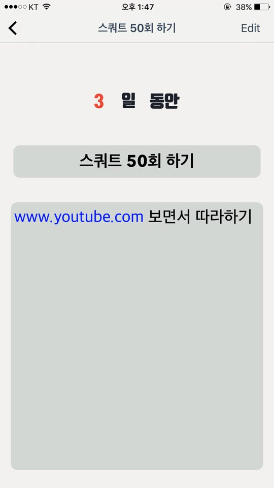
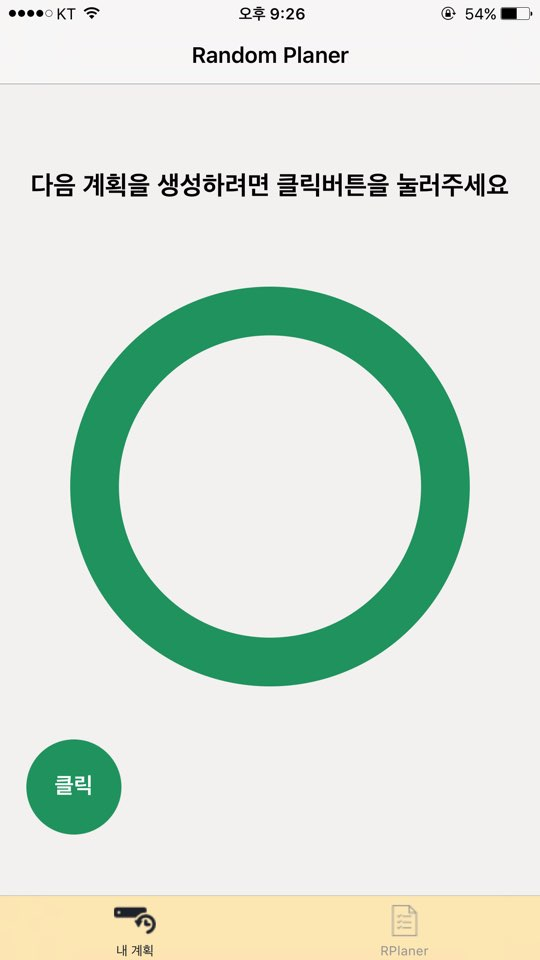
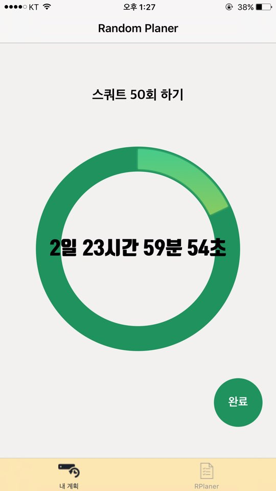
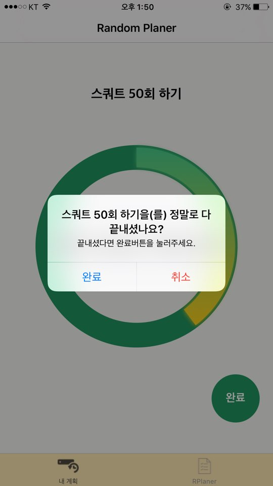
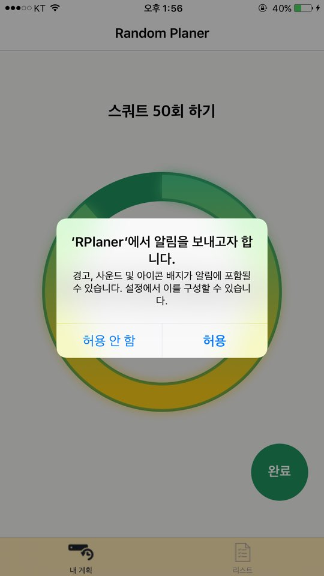

**Random Planer**
==================
계획을 세우기만 하고 지키지 못하는 사람들을 위한, 
재미있는 랜덤 계획 어플리케이션

  - 간편한 계획 생성
  - 시각적으로 한번에 볼 수 있는 카운트 다운과 그래프
  - 알림 기능

**RPlaner 앱 소개!**
---

> **Note:**

> -  간단하게 내가 하려는 계획들과 그 계획의 데드라인을 줄 수 있습니다. 
> -  내가 생성한 계획들은 가나다순 또는 최근 생성일 순으로 볼 수 있습니다. 
> -  랜덤한 계획을 뽑는 버튼을 누르면 내가 생성한 계획들중 랜덤한 계획이 나오게 됩니다. 
> -  뽑힌 계획은 유저가 생성할 때 주었던 데드라인부터 카운트다운을 시작하며, 그래프도 같이 움직이게 됩니다. 
> - 완료버튼을 누르면 바로 그 계획이 완료되는 것이 아닌, Alert를 이용해 유저에게 한번 더 확인을 하여 계획을 실천하는데 도움을 주도록 하였습니다.
> - 카운트 다운이 완료되면, 유저에게 notification을 주어 카운트다운이 끝났다는 메세지를 주게 됩니다. 

**스크린샷**
---

간단하게 계획과 데드라인을 정할 수 있으며, 메모를 남길 수 있습니다.

메모는 URL링크를 인식하며 DetailView에서 바로 웹페이지로 갈 수 있습니다. 

클릭버튼을 누르면 랜덤한 계획이 생성되며 곧바로 카운트다운이 시작됩니다.

카운트다운이 끝나기전에 계획을 완료했다면, 완료버튼을 눌러 계획을 완료할 수 있습니다. 

앱을 시작하면, 알림에 대한 Permission허가를 요청합니다.
허용을 하게되면,

카운트다운이 끝났을 시 알림이 오게 됩니다.

**구현**
--------

> - RealmSwift을 사용하여 사용자가 생성한 계획들을 Realm배열에 저장합니다.  수정, 삭제또한 Realm과 연동하여 이루어집니다. 
> - User Notification을 사용하여 유저에게 알림이 갑니다. 
> - KDCircularProgress라이브러리를 이용하여 그래프를 표시합니다. 
> 

**시연 동영상**
==========
따로 첨부하겠습니다. 
